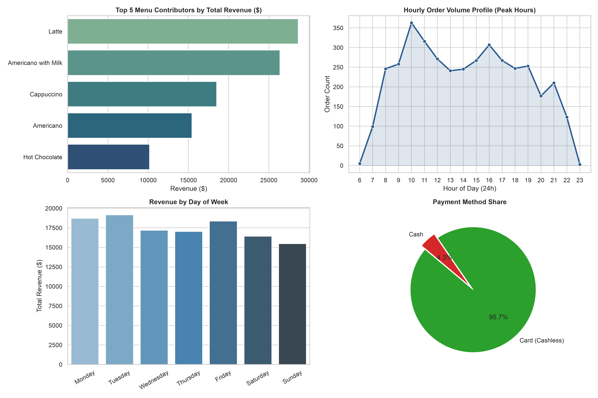

# Smart Coffee Retail Analytics & Customer Behavior


## Executive Dashboard


---

## Executive Summary
Analisis komprehensif terhadap **3.890+ transaksi ritel kopi** dari data operasional mesin kopi cerdas (*smart coffee kiosk*). Proyek ini mencakup alur data end-to-end: pembersihan dan rekayasa fitur waktu menggunakan **Python ETL**, pemodelan basis data di **MySQL**, visualisasi data menggunakan **Matplotlib & Seaborn**, hingga analisis bisnis mendalam meliputi **Segmentasi RFM Pelanggan**, **Pola Jam Sibuk Operasional**, dan **Optimasi Menu Berbasis Pareto**.

---

## Key Findings & Business Insights
* **Pola Jam Sibuk:** Lonjakan transaksi utama terjadi pada pukul **10:00 - 11:00** (>670 pesanan) dan sore hari pukul **16:00** (307 pesanan dengan rata-rata belanja tertinggi $32.07).
* **Segmentasi RFM:** Terpetakan 1.316 pelanggan kartu unik, memisahkan *Loyal Champions* dari segmen *At-Risk* (>150 hari tidak bertransaksi).
* **Pareto Menu Kopi:** 4 Varian teratas (*Latte, Americano with Milk, Cappuccino, Americano*) menyumbang lebih dari **72% total pendapatan**.
* **Adopsi Cashless:** **95.66% transaksi** menggunakan kartu (*card*) dengan volume perputaran mencapai **$117,114.58**.

---

## Evaluation & Strategic Recommendations

### Operational & Behavioral Evaluation
* **Bottleneck Jam Sibuk Terkonsentrasi:** Tingginya volume pada pukul 10:00 dan 16:00 menciptakan risiko antrean dan kehabisan stok bahan baku (*stockout*) susu serta biji kopi di tengah jam operasional kritis.
* **Polarisasi Loyalitas Pelanggan:** Mayoritas basis pelanggan kartu berada pada kuadran frekuensi rendah, mengindikasikan retensi organik yang belum terikat program insentif berkelanjutan.

### Strategic Recommendations
* **Untuk Manajemen Operasional & Rantai Pasok:**
  * **Preventive Restocking Schedule:** Jadwalkan pengisian ulang bahan baku dan kalibrasi mesin pada waktu jeda operasional, yaitu sebelum pukul 09:30 dan 15:30.
  * **Menu Simplification:** Pertahankan fokus pasokan bahan baku pada 4 menu inti Pareto guna mengoptimalkan modal kerja inventaris.
* **Untuk Tim Pertumbuhan & Retensi (CRM):**
  * **Re-engagement Campaign:** Kirimkan kupon diskon personalisasi berbasis waktu (misal: *happy hour* 13:00–15:00) khusus bagi segmen pelanggan *At-Risk* untuk meratakan beban antrean di luar jam puncak.
  * **Loyalty Tiering:** Berikan skema *cashback* atau poin otomatis bagi pemegang kartu non-tunai guna memperkuat frekuensi pembelian.

### Synthesis & Conclusion
Penerapan analitik data operasional ritel cerdas membuktikan bahwa efisiensi inventaris dan pertumbuhan pendapatan ditentukan oleh manajemen jadwal pasokan di jam sibuk serta pemanfaatan segmentasi RFM untuk konversi pelanggan transaksional menjadi pelanggan loyal.

---

## Repository Structure
```text
├── index_1.csv
├── index_2.csv
├── coffee_business_dashboard.png
├── scripts/
│   ├── etl_coffee.py
│   └── generate_charts.py
├── sql/
│   └── coffee_advanced_analysis.sql
└── README.md
